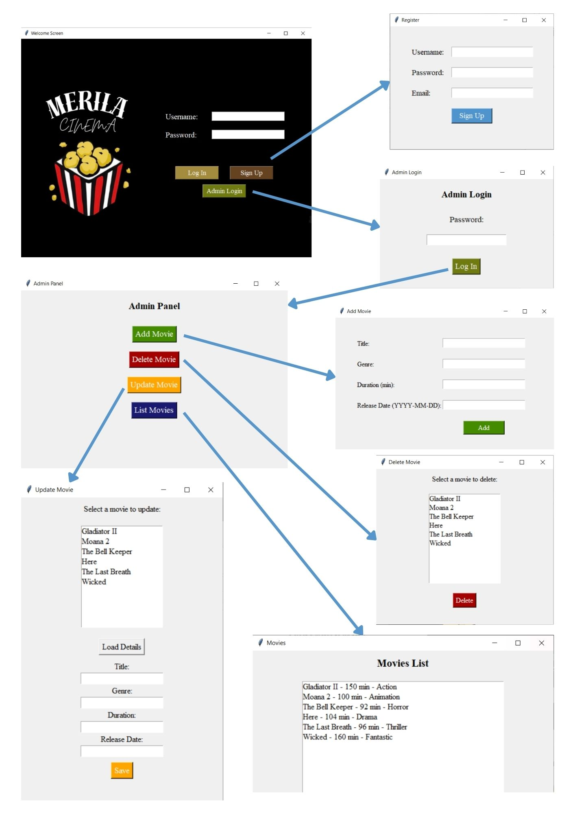
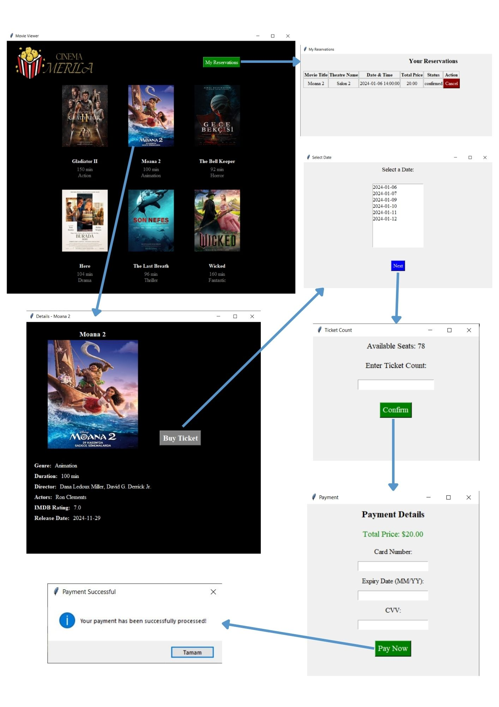

# 🎬 Movie Reservation System  

This project is a **movie reservation system** developed using **Python** and **MySQL**.  
Users can select movies, view sessions, and purchase tickets. The system also includes an **admin panel**, allowing administrators to manage movies, schedules, and reservations efficiently.  

---

## 🚀 Features  

### 🔹 User Management  
- Users can **create an account and log in** securely.  
- Users can **view and manage their reservation history**.  

### 🎞 Movie Management  
- Users can **browse a list of available movies**.  
- Each movie includes **detailed information** such as **IMDB rating, director, actors, and trailers**.  
- **Admin panel** allows administrators to **add, update, or delete movies**.  

### 🎟 Reservation and Ticketing  
- Users can **view available sessions** and **select their desired movie**.  
- Users can **choose a theater, select seats**, and **purchase tickets**.  
- **Reservation cancellation** is available for users.  

### 💳 Payment System  
- Users can **enter their payment details** to complete online transactions.  
- Payments are **securely processed and linked to reservations**.  
- Administrators can track **payment records**.  

---

## 📊 Database and Architecture  

### 📌 Database Schema  
The database contains well-structured relationships between **users, cinemas, movies, seat reservations, and payments**.  

---

## 🖥 User Interface (UI)  

Below are screenshots of the system’s **user interface**, providing a better understanding of the **user experience** and **workflow**.  

## 🖥 User Interface (UI)

### 🎟 User Interface

### 🎬 Admin Interface

---

## 👥 Contributors  

- **Merve Öncü**: [GitHub Profile](https://github.com/merve-oncu)  
- **Dilara Tetik**: [GitHub Profile](https://github.com/dilaratetik)  

We worked together as a team, combining our skills and efforts to build this project. Every step, from planning to implementation, was a joint effort, reflecting our teamwork and dedication.

---

## 📜 License  

This project is licensed under the **Apache 2.0 License**.  
For more details, check the [LICENSE](LICENSE) file.  

---

## ⭐ Contribute & Support  

If you like this project, **don’t forget to star ⭐ the repository on GitHub!**  

---
